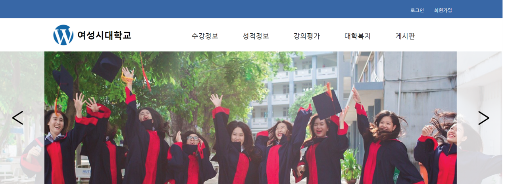
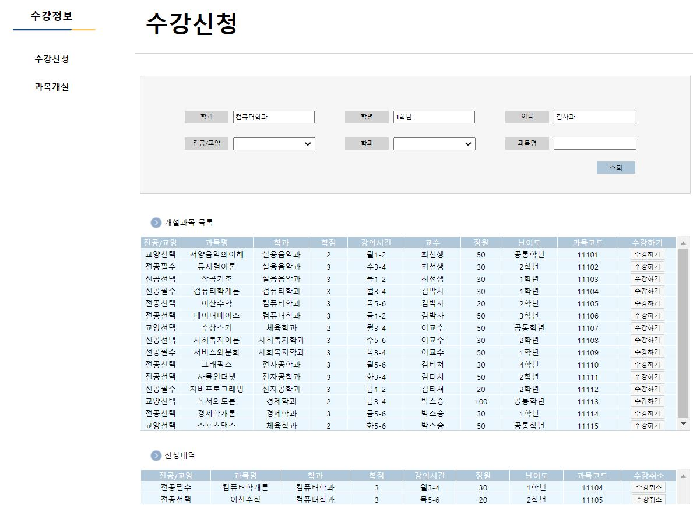
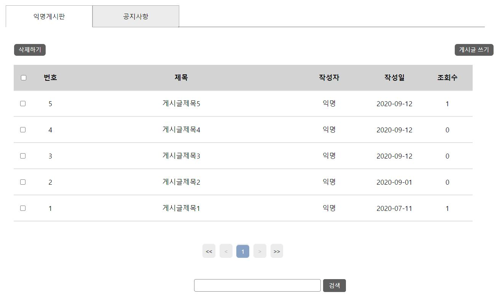
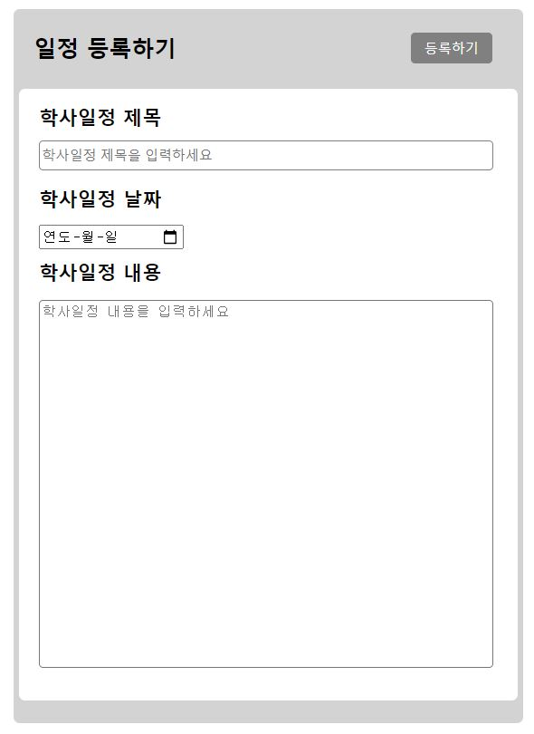

# :school: WGU e-Campus (대학교 통합 정보 홈페이지)
### 20.07.24 ~ 20.09.11

:ok_person: &nbsp; 팀장 : 김기쁨 
:family_woman_woman_girl_girl: 팀원 : 명다정, 이영실, 최하윤, 한지원

#

:globe_with_meridians: 개발환경
- Server : Apache Tomcat 9.0
- Database : Oracle 11g
- Development Tool : Eclipse 4.15.0, sqlDeveloper version 19.2.1.247
- Development Language :  JAVA , HTML5, CSS3, JavaScript, jQuery, SQL, JSP, Servlet
- Team Coop : Github, ERDCloud, kakaoOven

#

  :pencil2: 개요                                  
  학생들은 학교 홈페이지, e-class System, 종합정보시스템 등 필요한 웹페이지에 각각 접속해서 이용해야 합니다. 
  이러한 불편함을 해소하기  위하여 하나로 통합된 학사정보 시스템 구축. 학생들의 편리한 홈페이지 사용이 가능하도록 프로그램을 개발하게 되었습니다.
  
 
#

:calendar: 일정
- 7/24 ~ 7/29 기획회의 
- 7/30 ~ 8/5  UI설계회의(화면 설계, 구축) 
- 8/6  ~ 8/9  DB설계회의(테이블 설계, 구축) 
- 8/10 ~ 8/24 UI 구현
- 8/10 ~ 9/8  기능구현
- 9/9  ~ 9/11 통합테스트  

### :raising_hand: 맡은 파트

:yellow_heart: 영실
 - 로그인 로그아웃 회원가입 마이페이지
 - 로그인, 회원가입시 : 데이터베이스 이용
 - 마이페이지 : 개인정보 조회, 수정 (아이디,학번은 수정 불가능), 회원탈퇴(DELETE_YN) 
 - 아이디찾기  

:purple_heart: 기쁨
- 강의개설 : 교수만 가능. 동일 시간에 하나의 강의만 등록가능
- 개설강의 조회 & 수강신청 : 학생만 가능. 동일 시간에 하나의 강의만 수강신청 가능.
- 수강생조회 : 교수만 가능 
- 성적입력 , 수정 : 교수만 가능
- 성적조회 : 학생만 가능
- 강의평가 입력 : 학생은 수강한 강의에 대해 강의평가를 할 수 있다.
- 강의평가 조회 : 교수는 학생들의 강의 평가 내용을 확인할 수 있다.   

:orange_heart: 하윤
- 익명 게시판 등록, 수정, 삭제
- 게시판 댓글 등록, 수정, 삭제
- 공지사항 등록, 수정, 삭제 : 관리자만 가능. 학생과 교수는 조회만 가능하다. 
- 학사일정 등록, 수정, 삭제 : 관리자만 가능. 학생과 교수는 조회만 가능하다.  

 

:green_heart: 다정
- 학식정보( 식당 , 메뉴 , 가격 ) 등록, 수정, 삭제 : 관리자만 가능.
- 요일메뉴 등록, 수정 : 관리자만 가능.
- 식당조회 & 식권 구매 & 식권 조회   

:blue_heart: 지원
- 스쿨버스정보( 버스 목록 ,시간 ,목적지 ,좌석 ) 등록, 수정, 삭제 : 관리자만 가능. 
- 좌석 예매 & 예매 조회   

#

:star: 설계 주안점
- 비밀번호 암호화를 통해 보안을 강화
- 정규표현식을 사용하여 사용자가 입력한 정보에 대해 정해진 식에 맞춰 입력해야 회원가입이 될 수 있도록 있도록  유효성 검사 진행
- 일부 기능은 비동기방식으로, 화면전환이 아닌 한페이지 내에서 동작할 수 있게 한다.
- 게시판 수정할 때, 첨부파일 재등록시 등록했던 파일들을 삭제하고 새로운 첨부파일을 넣을 수 있도록 한다.
- 사용자(학생,교수)와 관리자를 구분하여 해당멤버만 이용할 수 있는 서비스를 제공   

#

:desktop_computer: 화면 일부  
메인화면 

 
수강신청 

 
게시판 

 
학사일정 

 
